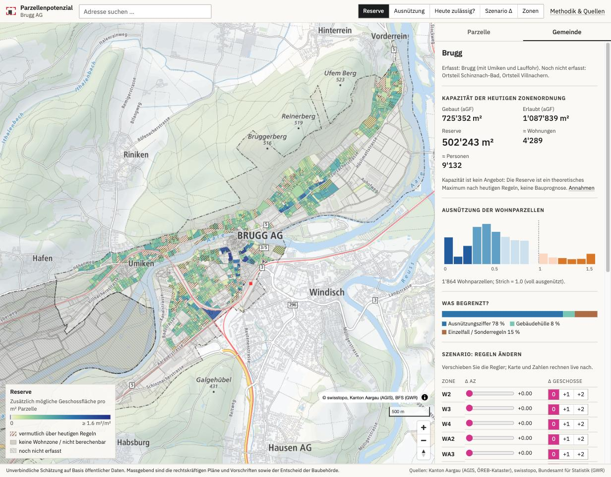

# Parcel Potential (Parzellenpotenzial)

How much floor area do the current zoning rules allow on each parcel, how much is
built, and which rule is the binding one? A transparent, parcel-by-parcel estimate
from open Swiss data. The prototype covers **Brugg AG** (Ortsteile Brugg, Umiken,
Lauffohr and Villnachern; Schinznach-Bad still missing) and **Windisch AG**. It is built to extend to all of Aargau and,
through the national data models, to other cantons.



- Spec: [`docs/SPEC.md`](docs/SPEC.md) · Decisions and verified identifiers: [`docs/decisions.md`](docs/decisions.md) · Progress: [`docs/progress.md`](docs/progress.md)

## Quick start

```bash
make build                             # Brugg; downloads ~1 GB raw data on first run (cached)
make build TERRITORY=AG-4123-windisch  # Windisch (reuses the canton downloads)
make test         # Python + TypeScript golden tests, and Python↔TS parity on the real data
make web          # http://localhost:5173
```

Requirements: [uv](https://docs.astral.sh/uv/) (Python 3.12 is installed automatically), Node ≥ 20.
No GDAL install needed (pyogrio/rasterio wheels bundle it).

## How it fits together

```
etl/territories/AG/4095-brugg.yaml   one current municipality → n planning perimeters (after mergers)
etl/rulebooks/AG/4095-brugg.yaml     parameters per zone, each with source/page/section/quote/verified
etl/config/default.yaml              every engine/pipeline assumption (shown on the methodology page)
        │
        ▼  pp build  (etl/src/pp_etl)
fetch/   geodienste.ch canton GeoPackages (AV, Nutzungsplanung), GWR (BFS), swissBOUNDARIES3D,
         swissBUILDINGS3D 3.0 (CityGML heights), swissALTI3D (slope)          → data/raw + manifest.json
build/   zone parts, buildable footprint per setback (party walls respected), existing floor area,
         flags (overlays, SDR, slope, infrastructure) → engine → calibration → export
engine/  capacity.py  ⇄  web/src/engine/capacity.ts   (same golden tests: tests/golden/*.json)
        │
        ▼
data/processed/<canton>/<bfs>/parcels.parquet   (canonical GeoParquet)
web/public/data/<canton>/<bfs>/…                (prototype web data; v1: PMTiles + GeoParquet)
        │
        ▼
web/  Vite + TypeScript + MapLibre. The browser recomputes every parcel live for scenarios.
```

### Adding a municipality

Follow [`docs/playbook-new-municipality.md`](docs/playbook-new-municipality.md). In short:

1. Add `etl/territories/<canton>/<bfs>-<name>.yaml`. It holds the boundary feature id and
   the planning perimeters; after a merger, historical swissBOUNDARIES3D ids delimit the old BNO areas.
2. Draft a rulebook: `make rules-extract PDF=… OUT=…`. Then fill `match` with the zone codes
   from the zoning dataset (`typ_kommunal_code` is only unique within a municipality).
3. `make rules-verify RULEBOOK=… BY=<name>` and `make build TERRITORY=<id>`.

Nothing in the code is Brugg-specific. The only canton-specific parts are the
canton code for geodienste.ch/GWR downloads and the rulebook contents.

## Status

See [`docs/progress.md`](docs/progress.md). **The rulebook is LLM-extracted and not yet
human-verified**, so every parcel is currently shown with low confidence.

## Disclaimer and attribution

Unverbindliche Schätzung auf Basis öffentlicher Daten. Massgebend sind die rechtskräftigen
Pläne und Vorschriften sowie der Entscheid der Baubehörde.

Quellen: Kanton Aargau (AGIS, Amtliche Vermessung, Nutzungsplanung via geodienste.ch),
swisstopo (swissBOUNDARIES3D, swissBUILDINGS3D 3.0, swissALTI3D, Basiskarte),
Bundesamt für Statistik (GWR), Stadt Brugg (BNO).
