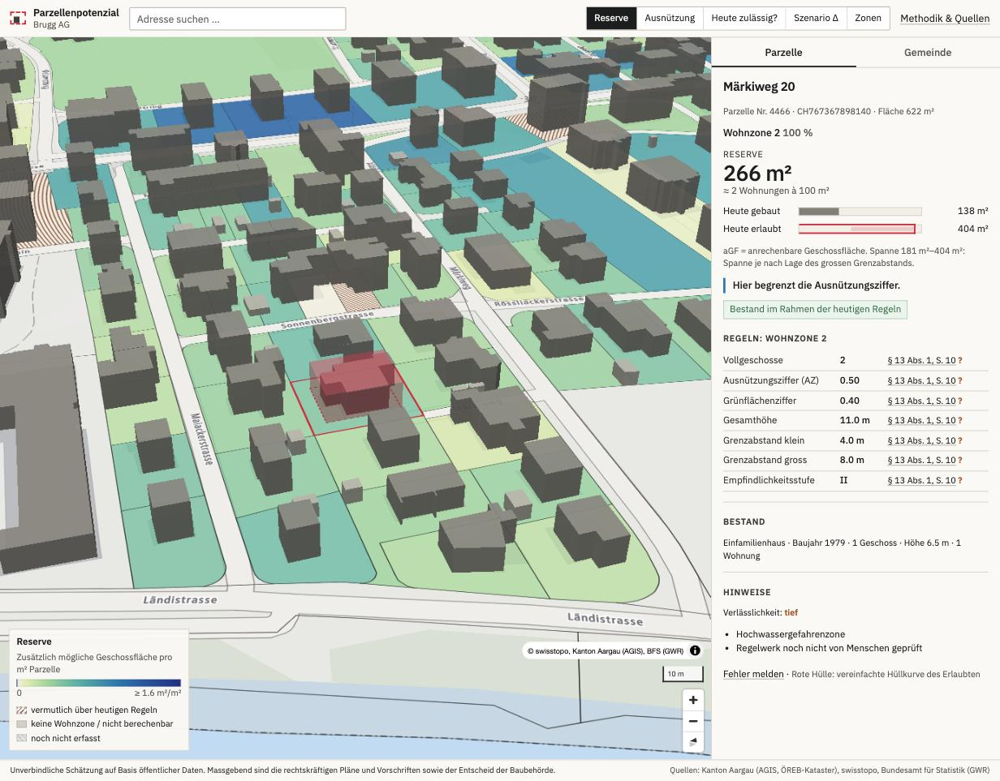
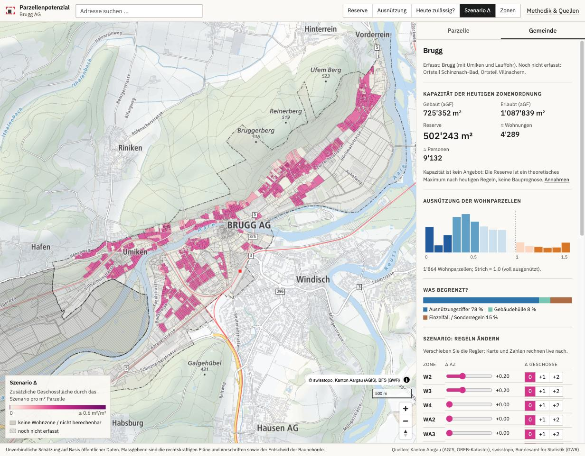

# Progress

## 2026-09-25 — v0 Brugg (first night)

### Milestones

| Milestone | Status | Notes |
|---|---|---|
| M0 Scaffold + fetch | ✅ | `make data` / `make build`; manifest in `data/manifest.json`; all (verify) items logged in `decisions.md` (a few ⏳) |
| M1 Join + inspect | ✅ | **99.7%** of existing GWR residential buildings matched to an AV footprint (target > 95%); 85.7% of footprints have a swissBUILDINGS3D height |
| M2 Rulebook | 🟡 | Brugg/Umiken rulebook: 22 zones, 93 values with source/page/section/quote; schema passes. **0/93 human-verified** → run `make rules-verify RULEBOOK=AG/4095-brugg.yaml BY=Stephan` |
| M3 Engine | ✅ | Python engine, 20 golden cases (spec asks ≥ 15), calibration reported (`existing_to_agf = 0.796`) |
| M4 Map + inspector | ✅ | Headroom layer, 3D buildings, ghost envelope, inspector with rule table and source links, "allowed today?" layer, zones layer, address search |
| M5 Scenarios + policy | ✅ | TS engine mirror (20/20 golden), **Python↔TS parity on all 4,579 parcels, totals and every blocker scenario**; sliders; bonuses; blocker ranking (CSV/SVG); CSV export; methodology page |
| M6 P1 | 🟡 | Slope flag done; overlay flags (Gestaltungsplan, Hochhaus, Substanzschutz, flood hazard, Gewässerraum, Nachverdichtung) done as flags; single-family options, ISOS, soft-site score, Schinznach-Bad/Villnachern rulebooks, station predicate, one-pager: open |

### Headline numbers (Brugg/Umiken, optimistic setbacks, unverified rulebook)

- Existing aGF 725k m², allowed 1.09M m² → **reserve 502k m² ≈ 4,300 dwellings** (theoretical capacity, not supply)
- Binding constraint on residential parcels: AZ 78%, envelope 8%, discretionary 15%
- Blocker ranking: **AZ +0.1 in all residential zones ≈ +146k m² (≈1,400 dwellings)**; AZ +0.1 in W2 alone ≈ +78k m². +1 full storey adds almost nothing in AZ-bound zones and matters mainly in the Zentrumszone
- 288 parcels "vermutlich über heutigen Regeln", mostly older multi-storey buildings and tiny row-house parcels

### QA locations (§11.5)

| Location | Expected | Result |
|---|---|---|
| Altstadt | discretionary, heritage | 172/183 discretionary ✓; heritage only via Substanzschutz overlay (ISOS P1) |
| EFH streets 1960–85 | headroom, slope | 312 parcels, median utilisation 0.60, 75% slope-flagged ✓ |
| Recent MFH (≥ 2019) | utilisation ≈ 1 | median 1.03 ✓ |
| Hochhausstandort | flag | 15 parcels ✓ |
| Zone Campus | non-residential | discretionary (see decision 9) |

### Screenshots

### Open / next

- Human verification of the rulebook (blocks confidence > low)
- Spot-check 5 values against ÖREB extracts (§11.1); hand check of 10 parcels (§11.3)
- Bauzonenstatistik comparison (§11.4): unbuilt residential parcels currently 219 parcels / 17 ha / 88k m² aGF
- Baulinien (separate AGIS dataset), Planungszonen flag, ISOS overlay
- Schinznach-Bad and Villnachern rulebooks
- v1 data delivery: PMTiles + GeoParquet
